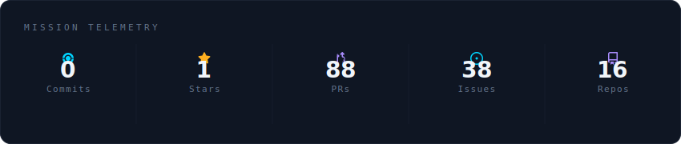

<section id="welcome" style="display: grid; justify-content: center; text-align: center;">

# 

</section>

<section id="stats">

  

 

  

 

  

 

  
  
  

<picture align="center">
  <source media="(prefers-color-scheme: dark)" srcset="https://raw.githubusercontent.com/nicolefemello/nicolefemello/output/github-contribution-grid-snake-dark.svg">
  <source media="(prefers-color-scheme: light)" srcset="https://raw.githubusercontent.com/nicolefemello/nicolefemello/output/github-contribution-grid-snake-dark.svg">
  
</picture>

---

Desenvolvido com 💙 por <strong>nicolefemello</strong>

